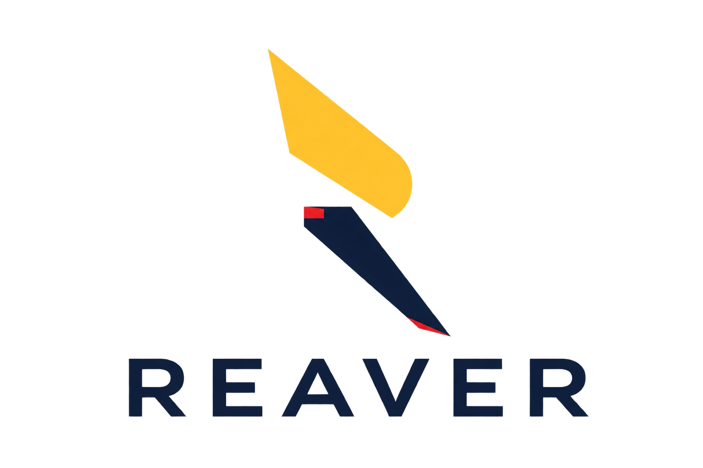

<div align="center">



# ⚔️ REAVER

**Universal MCP-First Autonomous Lead Intelligence**
*Capabl AI Hackathon 2026 · Track D · Problem Statement D1*

`MCP 1.26` `Python 3.14` `LangGraph` `SQLite` `zero ML deps`

`selfcheck 75/75` · `evals 11/11` · `secret-scan clean` · `live runs proven`

*Any target. Verified leads. Zero misses.*

[⚔️ Hunt now](https://reaver.antarik.co/playground) · [📖 MCP docs](https://reaver.antarik.co/mcp-docs) · [🔌 Connect](https://reaver.antarik.co/connect)

</div>

---

<svg width="100%" height="150" viewBox="0 0 900 150" xmlns="http://www.w3.org/2000/svg">
<defs><marker id="ah" markerWidth="8" markerHeight="8" refX="7" refY="4" orient="auto"><path d="M0,0 L8,4 L0,8" fill="none" stroke="#f2b705" stroke-width="1.5"/></marker></defs>
<g font-family="monospace" font-size="15" fill="#f4f6fb" text-anchor="middle">
<rect x="6" y="45" width="126" height="46" rx="8" fill="#0e1626" stroke="#22304f"/>
<rect x="152" y="45" width="126" height="46" rx="8" fill="#0e1626" stroke="#22304f"/>
<rect x="298" y="45" width="126" height="46" rx="8" fill="#0e1626" stroke="#22304f"/>
<rect x="444" y="45" width="126" height="46" rx="8" fill="#0e1626" stroke="#22304f"/>
<rect x="590" y="45" width="126" height="46" rx="8" fill="#0e1626" stroke="#22304f"/>
<rect x="736" y="45" width="126" height="46" rx="8" fill="#0e1626" stroke="#22304f"/>
<text x="69" y="63">compile</text><text x="69" y="80" fill="#9aa3b8" font-size="10">NL → spec</text>
<text x="215" y="63">discover</text><text x="215" y="80" fill="#9aa3b8" font-size="10">11 backends</text>
<text x="361" y="63">research</text><text x="361" y="80" fill="#9aa3b8" font-size="10">robots-gated</text>
<text x="507" y="63">qualify</text><text x="507" y="80" fill="#9aa3b8" font-size="10">PASS/FAIL/?</text>
<text x="653" y="63">dedupe</text><text x="653" y="80" fill="#9aa3b8" font-size="10">merge</text>
<text x="799" y="63">export</text><text x="799" y="80" fill="#9aa3b8" font-size="10">CSV/JSON</text>
</g>
<g stroke="#f2b705" stroke-width="2" fill="none">
<line x1="132" y1="68" x2="150" y2="68" marker-end="url(#ah)"/>
<line x1="278" y1="68" x2="296" y2="68" marker-end="url(#ah)"/>
<line x1="424" y1="68" x2="442" y2="68" marker-end="url(#ah)"/>
<line x1="570" y1="68" x2="588" y2="68" marker-end="url(#ah)"/>
<line x1="716" y1="68" x2="734" y2="68" marker-end="url(#ah)"/>
<rect x="6" y="45" width="126" height="46" rx="8" fill="none" stroke="#f2b705" stroke-dasharray="6 340" opacity="0.9">
<animate attributeName="stroke-dashoffset" from="346" to="0" dur="4s" repeatCount="indefinite"/>
</rect>
</g>
</svg>

## The problem

Sales teams drown in manual prospecting — hunting companies across LinkedIn, directories,
and search, then judging fit by gut feel. Existing tools are single-vertical, single-country,
black-box scores with zero evidence. **Nobody can answer: *why* is this lead qualified?**

## The solution: REAVER

Describe **any legitimate target** in plain words — bakeries in Ahmedabad, B2B SaaS across
India, vendors anywhere. REAVER discovers candidates across **11 routed sources**, researches
each behind a **robots.txt gate**, enriches (Apollo, Hunter, maps, GitHub), grades every
criterion in **code** (PASS / FAIL / UNKNOWN), cites **retrieved passages** for every PASS,
deduplicates by entity resolution, and exports **CSV or JSON**. Missing evidence is declared
missing. Conflicts surface side-by-side. Nothing is ever invented.

```text
"Find 20 bakeries in Ahmedabad"
        │
Target compiler ──► Search plan ──► Multi-source discovery (rotating backends)
        │                                              │
   Business context                              Research waves ×3
   (optional booster)                                  │
                                              Enrich: Apollo · Hunter · OSM · GitHub · Apify
                                                       │
                              Verify ──► Qualify ──► Dedupe ──► Deliver (+rejected with reasons)
```

## Use it anywhere (12 hosts)

| Local, no auth (stdio) | Remote, token (HTTPS) | Test |
|---|---|---|
| Claude Code/Desktop, OpenCode, Kimi CLI, MiniMax, Cursor, Windsurf, Cline, Codex | ChatGPT, Claude API, any MCP client | Inspector, `setup_mcp.py --check` |

```bash
pip install -r requirements.txt && cp .env.example .env   # fill keys
python -m engine.selfcheck          # 75 checks, offline
python scripts/setup_mcp.py --install claude-code   # kimi mcode cursor windsurf cline codex …
python scripts/setup_mcp.py --check                  # 10 live tools
```

Non-technical users: **`/connect`** issues a capped token with one click + GUI guides.
No terminal? No problem. BYOK Playground: Groq, Gemini, OpenRouter, OpenAI, Anthropic,
Moonshot/MiniMax/custom endpoints — your keys never leave the server.

## Screenshots (captured live via Playwright, localhost)

| Playground — the Armory | MCP docs — the Arsenal |
|---|---|
|  |  |
| **Zero-terminal onboarding** | **Landing — Forged hero** |
|  |  |

## Why trust it

| Claim | Proof |
|---|---|
| No hallucinated leads | `evals`: nonsense input → empty/UNCERTAIN, never invented |
| Conflicts shown, not averaged | 120 vs 400 employees → UNCERTAIN + both sources preserved |
| RAG is load-bearing | Ablation: no passages flips every PASS to UNKNOWN |
| Stale facts age out | TTLs per criterion; refresh states REFRESHED/FRESH/STALE/GONE |
| Sources fail honestly | Fallback recorded; budgets enforced; `doctor` burns no quota |
| Secrets stay secret | Tracked-file secret scan green; keys never cross tool boundaries |

## Deploy (live)

Vercel static (`/`, `/mcp-docs`, `/connect`) + Railway Python (`/playground`, `/api/*`, `/mcp/`)
behind `reaver.antarik.co` — see `vercel.json`, `Procfile`, `PHASES.md` for the full topology.

## Docs & plans

- Brief: `D1_Universal_Lead_Intelligence_MCP_Ideation.md` · Build: `PHASES.md` · Universal: `PHASES_UNIVERSAL.md`
- User docs: `/mcp-docs` · Onboarding: `/connect` · Video package: `video/` · License: MIT
