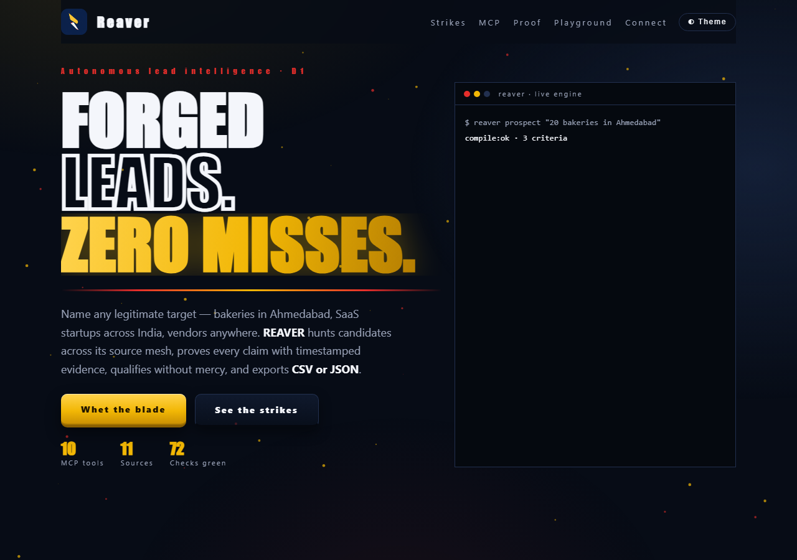
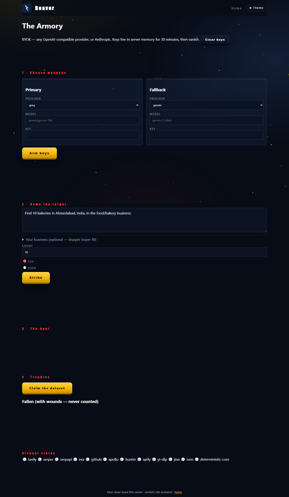
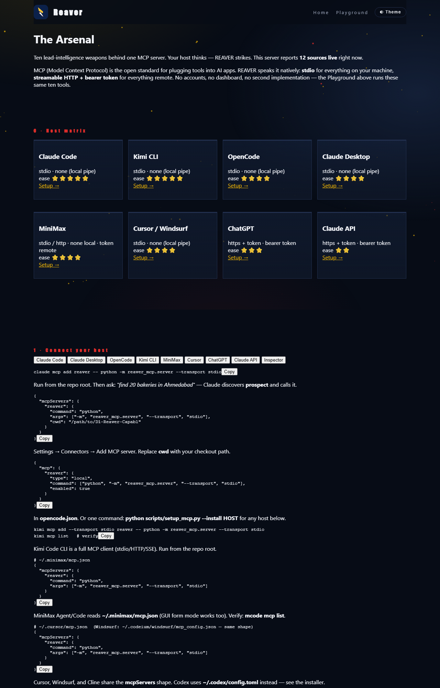
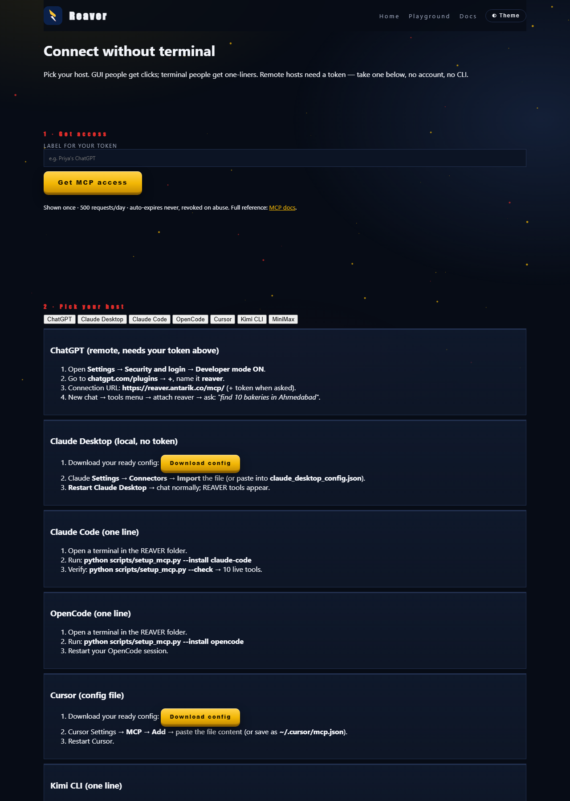

# ⚔️ REAVER — Universal MCP-First Lead Intelligence

> **Capabl AI Hackathon 2026 · Track D · Problem Statement D1**
> *Autonomous Lead Generation & Qualification Agent*

```
STANDARDS  MCP 1.26 · Python 3.14 · LangGraph · SQLite · zero ML deps
CHECKS     selfcheck 72/72 · evals 11/11 · secret-scan clean · live runs proven
OUTPUTS    CSV (default, HubSpot-mappable) · JSON — nothing else
```



One autonomous agent that turns **plain words into verified, qualified, deduplicated leads** —
any industry, any geography, any legitimate target — from the AI environment you already use.

## How it works (live pipeline)

<svg width="100%" height="120" viewBox="0 0 900 120" xmlns="http://www.w3.org/2000/svg">
<defs><marker id="ah" markerWidth="8" markerHeight="8" refX="7" refY="4" orient="auto"><path d="M0,0 L8,4 L0,8" fill="none" stroke="#f2b705" stroke-width="1.5"/></marker></defs>
<g font-family="monospace" font-size="13" fill="#f4f6fb" text-anchor="middle">
<rect x="8" y="38" width="118" height="44" rx="8" fill="#0e1626" stroke="#22304f"/>
<rect x="146" y="38" width="118" height="44" rx="8" fill="#0e1626" stroke="#22304f"/>
<rect x="284" y="38" width="118" height="44" rx="8" fill="#0e1626" stroke="#22304f"/>
<rect x="422" y="38" width="118" height="44" rx="8" fill="#0e1626" stroke="#22304f"/>
<rect x="560" y="38" width="118" height="44" rx="8" fill="#0e1626" stroke="#22304f"/>
<rect x="698" y="38" width="118" height="44" rx="8" fill="#0e1626" stroke="#22304f"/>
<text x="67" y="55">compile</text><text x="67" y="72" fill="#9aa3b8" font-size="10">NL → spec</text>
<text x="205" y="55">discover</text><text x="205" y="72" fill="#9aa3b8" font-size="10">11 backends</text>
<text x="343" y="55">research</text><text x="343" y="72" fill="#9aa3b8" font-size="10">robots-gated</text>
<text x="481" y="55">qualify</text><text x="481" y="72" fill="#9aa3b8" font-size="10">PASS/FAIL/?</text>
<text x="619" y="55">dedupe</text><text x="619" y="72" fill="#9aa3b8" font-size="10">merge</text>
<text x="757" y="55">export</text><text x="757" y="72" fill="#9aa3b8" font-size="10">CSV/JSON</text>
</g>
<g stroke="#f2b705" stroke-width="2" fill="none">
<line x1="126" y1="60" x2="144" y2="60" marker-end="url(#ah)"/>
<line x1="264" y1="60" x2="282" y2="60" marker-end="url(#ah)"/>
<line x1="402" y1="60" x2="420" y2="60" marker-end="url(#ah)"/>
<line x1="540" y1="60" x2="558" y2="60" marker-end="url(#ah)"/>
<line x1="678" y1="60" x2="696" y2="60" marker-end="url(#ah)"/>
<rect x="8" y="38" width="118" height="44" rx="8" fill="none" stroke="#f2b705" stroke-dasharray="6 300" opacity="0.9">
<animate attributeName="stroke-dashoffset" from="306" to="0" dur="4s" repeatCount="indefinite"/>
</rect>
</g>
</svg>

`compile → plan → discover → prefilter → research → enrich → verify → qualify → dedupe → export`
(LangGraph, SQLite checkpoint resume; **LLM extracts, code grades** — a PASS with no cited passage becomes UNKNOWN.)

## 30-second quickstart

```bash
pip install -r requirements.txt && cp .env.example .env   # fill keys
python -m engine.selfcheck     # 72 checks, offline
python scripts/setup_mcp.py --install claude-code   # or: desktop opencode kimi mcode cursor windsurf cline codex
python scripts/setup_mcp.py --check                  # 10 live tools
```

Then ask your host: *"find 20 bakeries in Ahmedabad"* — or open the Playground.

## Use it anywhere (12 hosts)

| Local (stdio, no auth) | Remote (HTTPS + token) | Test |
|---|---|---|
| Claude Code/Desktop, OpenCode, Kimi CLI, MiniMax, Cursor, Windsurf, Cline, Codex | ChatGPT, Claude API, any MCP client | Inspector, `setup_mcp.py --check` |

Non-technical users: **`/connect`** issues a capped token with one click + GUI guides.
BYOK Playground: Groq, Gemini, OpenRouter, OpenAI, Anthropic, Moonshot/MiniMax/custom endpoints.

## Screenshots (captured live via Playwright, localhost)

| Playground | MCP docs |
|---|---|
|  |  |
| **Connect onboarding** | |
|  | |

## Why trust it

- **Evidence-first:** every verdict cites retrieved passages; conflicts surface side-by-side; missing = UNKNOWN.
- **Compliant:** unconditional robots.txt gate, authorized APIs only, failures recorded with fallbacks.
- **Portable honesty:** reruns reuse fresh evidence; budgets cap metered calls; secrets never cross tool boundaries.
- **Proof:** `python scripts/demo.py` runs checks + evals + secret scan + live prospect.

## Deploy

Vercel static (`/`, `/mcp-docs`, `/connect`) + Railway Python (`/playground`, `/api/*`, `/mcp/`)
behind `reaver.antarik.co` — see `vercel.json`, `Procfile`, README deploy section in `PHASES.md`.

## Docs & plans

- Brief: `D1_Universal_Lead_Intelligence_MCP_Ideation.md` · Plan: `PHASES.md` · Sequel: `PHASES_UNIVERSAL.md`
- User docs: `/mcp-docs` · Zero-terminal: `/connect` · License: MIT
